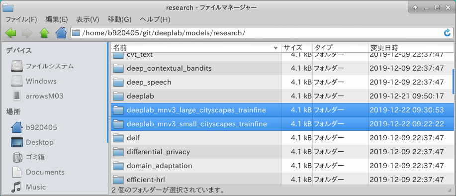
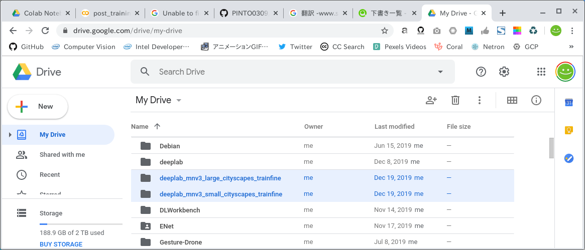

# PINTO_model_zoo

## 1. Environment

- Ubuntu 18.04
- Tensorflow-GPU v1.15.0
- Python 3.6.8
- PascalVOC Dataset
- Cityscapes Dataset

## 2. Procedure
### 2-1. MobileNetV3+DeeplabV3+PascalVOC
#### 2-1-1. Preparation
```bash
$ cd ~
$ mkdir deeplab;cd deeplab
$ git clone --depth 1 https://github.com/tensorflow/models.git
$ cd models/research/deeplab/datasets
$ mkdir pascal_voc_seg

$ curl -sc /tmp/cookie "https://drive.google.com/uc?export=download&id=1rATNHizJdVHnaJtt-hW9MOgjxoaajzdh" > /dev/null
$ CODE="$(awk '/_warning_/ {print $NF}' /tmp/cookie)"
$ curl -Lb /tmp/cookie "https://drive.google.com/uc?export=download&confirm=${CODE}&id=1rATNHizJdVHnaJtt-hW9MOgjxoaajzdh" -o pascal_voc_seg/VOCtrainval_11-May-2012.tar

$ sed -i -e "s/python .\/remove_gt_colormap.py/python3 .\/remove_gt_colormap.py/g" \
      -i -e "s/python .\/build_voc2012_data.py/python3 .\/build_voc2012_data.py/g" \
      download_and_convert_voc2012.sh

$ sh download_and_convert_voc2012.sh

$ cd ../..
$ mkdir -p deeplab/datasets/pascal_voc_seg/exp/train_on_train_set/train
$ mkdir -p deeplab/datasets/pascal_voc_seg/exp/train_on_train_set/eval
$ mkdir -p deeplab/datasets/pascal_voc_seg/exp/train_on_train_set/vis

$ export PATH_TO_TRAIN_DIR=${HOME}/deeplab/models/research/deeplab/datasets/pascal_voc_seg/exp/train_on_train_set/train
$ export PATH_TO_DATASET=${HOME}/deeplab/models/research/deeplab/datasets/pascal_voc_seg/tfrecord
$ export PYTHONPATH=${HOME}/deeplab/models/research:${HOME}/deeplab/models/research/deeplab:${HOME}/deeplab/models/research/slim:${PYTHONPATH}
```

```python
# See feature_extractor.network_map for supported model variants.
# models/research/deeplab/core/feature_extractor.py

networks_map = {
    'mobilenet_v2': _mobilenet_v2,
    'mobilenet_v3_large_seg': mobilenet_v3_large_seg,
    'mobilenet_v3_small_seg': mobilenet_v3_small_seg,
    'resnet_v1_18': resnet_v1_beta.resnet_v1_18,
    'resnet_v1_18_beta': resnet_v1_beta.resnet_v1_18_beta,
    'resnet_v1_50': resnet_v1_beta.resnet_v1_50,
    'resnet_v1_50_beta': resnet_v1_beta.resnet_v1_50_beta,
    'resnet_v1_101': resnet_v1_beta.resnet_v1_101,
    'resnet_v1_101_beta': resnet_v1_beta.resnet_v1_101_beta,
    'xception_41': xception.xception_41,
    'xception_65': xception.xception_65,
    'xception_71': xception.xception_71,
    'nas_pnasnet': nas_network.pnasnet,
    'nas_hnasnet': nas_network.hnasnet,
}
```
#### 2-1-2. "mobilenet_v3_small_seg" Float32 regular training
```bash
$ python3 deeplab/train.py \
    --logtostderr \
    --training_number_of_steps=500000 \
    --train_split="train" \
    --model_variant="mobilenet_v3_small_seg" \
    --decoder_output_stride=16 \
    --train_crop_size="513,513" \
    --train_batch_size=8 \
    --dataset="pascal_voc_seg" \
    --save_interval_secs=300 \
    --save_summaries_secs=300 \
    --save_summaries_images=True \
    --log_steps=100 \
    --train_logdir=${PATH_TO_TRAIN_DIR} \
    --dataset_dir=${PATH_TO_DATASET}
```

#### 2-1-3. "mobilenet_v3_large_seg" Float32 regular training
```bash
$ python3 deeplab/train.py \
    --logtostderr \
    --training_number_of_steps=1000000 \
    --train_split="train" \
    --model_variant="mobilenet_v3_large_seg" \
    --decoder_output_stride=16 \
    --train_crop_size="513,513" \
    --train_batch_size=8 \
    --dataset="pascal_voc_seg" \
    --save_interval_secs=300 \
    --save_summaries_secs=300 \
    --save_summaries_images=True \
    --log_steps=100 \
    --train_logdir=${PATH_TO_TRAIN_DIR} \
    --dataset_dir=${PATH_TO_DATASET}
```

#### 2-1-4. Visualize training status
```bash
$ tensorboard --logdir ${HOME}/deeplab/models/research/deeplab/datasets/pascal_voc_seg/exp/train_on_train_set/train
```
　  
　  
### 2-2. MobileNetV3+DeeplabV3+Cityscaps
#### 2-2-1. Preparation
```bash
$ cd ~
$ mkdir -p git/deeplab && cd git/deeplab
$ git clone --depth 1 https://github.com/tensorflow/models.git
$ cd models/research/deeplab/datasets
$ mkdir cityscapes && cd cityscapes

$ git clone --depth 1 https://github.com/mcordts/cityscapesScripts.git
$ mv cityscapesScripts cityscapesScripts_ && \
  mv cityscapesScripts_/cityscapesscripts . && \
  rm -rf cityscapesScripts_

$ wget --keep-session-cookies --save-cookies=cookies.txt --post-data 'username=(userid)&password=(password)&submit=Login' https://www.cityscapes-dataset.com/login/
$ wget --load-cookies cookies.txt --content-disposition https://www.cityscapes-dataset.com/file-handling/?packageID=1
$ wget --load-cookies cookies.txt --content-disposition https://www.cityscapes-dataset.com/file-handling/?packageID=3

$ unzip gtFine_trainvaltest.zip && rm gtFine_trainvaltest.zip
$ rm README && rm license.txt
$ unzip leftImg8bit_trainvaltest.zip && rm leftImg8bit_trainvaltest.zip
$ rm README && rm license.txt

$ cd ..
$ sed -i -e "s/python/python3/g" convert_cityscapes.sh
$ export PYTHONPATH=${HOME}/git/deeplab/models/research/deeplab/datasets/cityscapes:${PYTHONPATH}
$ sh convert_cityscapes.sh

$ cd ../..
$ mkdir -p deeplab/datasets/cityscapes/exp/train_on_train_set/train && \
  mkdir -p deeplab/datasets/cityscapes/exp/train_on_train_set/eval && \
  mkdir -p deeplab/datasets/cityscapes/exp/train_on_train_set/vis

$ curl -sc /tmp/cookie "https://drive.google.com/uc?export=download&id=1f5ccaJmJBYwBmHvRQ77yGIUcXnqQIRY_" > /dev/null
$ CODE="$(awk '/_warning_/ {print $NF}' /tmp/cookie)"
$ curl -Lb /tmp/cookie "https://drive.google.com/uc?export=download&confirm=${CODE}&id=1f5ccaJmJBYwBmHvRQ77yGIUcXnqQIRY_" -o deeplab_mnv3_small_cityscapes_trainfine_2019_11_15.tar.gz
$ tar -zxvf deeplab_mnv3_small_cityscapes_trainfine_2019_11_15.tar.gz
$ rm deeplab_mnv3_small_cityscapes_trainfine_2019_11_15.tar.gz

$ curl -sc /tmp/cookie "https://drive.google.com/uc?export=download&id=1QxS3G55rUQvuiBF-hztQv5zCkfPfwlVU" > /dev/null
$ CODE="$(awk '/_warning_/ {print $NF}' /tmp/cookie)"
$ curl -Lb /tmp/cookie "https://drive.google.com/uc?export=download&confirm=${CODE}&id=1QxS3G55rUQvuiBF-hztQv5zCkfPfwlVU" -o deeplab_mnv3_large_cityscapes_trainfine_2019_11_15.tar.gz
$ tar -zxvf deeplab_mnv3_large_cityscapes_trainfine_2019_11_15.tar.gz
$ rm deeplab_mnv3_large_cityscapes_trainfine_2019_11_15.tar.gz

$ export PATH_TO_INITIAL_CHECKPOINT=${HOME}/git/deeplab/models/research/deeplab_mnv3_small_cityscapes_trainfine/model.ckpt
$ export PATH_TO_DATASET=${HOME}/git/deeplab/models/research/deeplab/datasets/cityscapes/tfrecord
$ export PYTHONPATH=${HOME}/git/deeplab/models/research:${HOME}/git/deeplab/models/research/deeplab:${HOME}/git/deeplab/models/research/slim:${PYTHONPATH}

$ sed -i -e "s/splits_to_sizes={'train_fine': 2975,/splits_to_sizes={'train': 2975,/g" deeplab/datasets/data_generator.py

$ cd ${HOME}/git/deeplab/models/research
$ cp deeplab/export_model.py deeplab/export_model.py_org
$ cp deeplab_mnv3_small_cityscapes_trainfine/frozen_inference_graph.pb deeplab_mnv3_small_cityscapes_trainfine/frozen_inference_graph_org.pb
$ cp deeplab_mnv3_large_cityscapes_trainfine/frozen_inference_graph.pb deeplab_mnv3_large_cityscapes_trainfine/frozen_inference_graph_org.pb

$ sed -i -e "s/tf.placeholder(tf.uint8, \[1, None, None, 3\], name=_INPUT_NAME)/tf.placeholder(tf.float32, \[1, 769, 769, 3\], name=_INPUT_NAME)/g" deeplab/export_model.py
```
#### 2-2-2. Parameter sheet
```bash
# crop_size and image_pooling_crop_size are multiples of --decoder_output_stride + 1
# 769 = 8 * 96 + 1
# 512 = 8 * 64 + 1
# 320 = 8 * 40 + 1

# --initialize_last_layer=True initializes the final layer with the weight of tf_initial_checkpoint (inherits the weight)

# Named tuple to describe the dataset properties.
# deeplab/datasets/data_generator.py
DatasetDescriptor = collections.namedtuple(
    'DatasetDescriptor',
    [
        'splits_to_sizes',  # Splits of the dataset into training, val and test.
        'num_classes',  # Number of semantic classes, including the
                        # background class (if exists). For example, there
                        # are 20 foreground classes + 1 background class in
                        # the PASCAL VOC 2012 dataset. Thus, we set
                        # num_classes=21.
        'ignore_label',  # Ignore label value.
    ])

_CITYSCAPES_INFORMATION = DatasetDescriptor(
    splits_to_sizes={'train': 2975,
                     'train_coarse': 22973,
                     'trainval_fine': 3475,
                     'trainval_coarse': 23473,
                     'val_fine': 500,
                     'test_fine': 1525},
    num_classes=19,
    ignore_label=255,
)

_PASCAL_VOC_SEG_INFORMATION = DatasetDescriptor(
    splits_to_sizes={
        'train': 1464,
        'train_aug': 10582,
        'trainval': 2913,
        'val': 1449,
    },
    num_classes=21,
    ignore_label=255,
)

_ADE20K_INFORMATION = DatasetDescriptor(
    splits_to_sizes={
        'train': 20210,  # num of samples in images/training
        'val': 2000,  # num of samples in images/validation
    },
    num_classes=151,
    ignore_label=0,
)

_DATASETS_INFORMATION = {
    'cityscapes': _CITYSCAPES_INFORMATION,
    'pascal_voc_seg': _PASCAL_VOC_SEG_INFORMATION,
    'ade20k': _ADE20K_INFORMATION,
}

# A map from network name to network function. model_variant.
# deeplab/core/feature_extractor.py
networks_map = {
    'mobilenet_v2': _mobilenet_v2,
    'mobilenet_v3_large_seg': mobilenet_v3_large_seg,
    'mobilenet_v3_small_seg': mobilenet_v3_small_seg,
    'resnet_v1_18': resnet_v1_beta.resnet_v1_18,
    'resnet_v1_18_beta': resnet_v1_beta.resnet_v1_18_beta,
    'resnet_v1_50': resnet_v1_beta.resnet_v1_50,
    'resnet_v1_50_beta': resnet_v1_beta.resnet_v1_50_beta,
    'resnet_v1_101': resnet_v1_beta.resnet_v1_101,
    'resnet_v1_101_beta': resnet_v1_beta.resnet_v1_101_beta,
    'xception_41': xception.xception_41,
    'xception_65': xception.xception_65,
    'xception_71': xception.xception_71,
    'nas_pnasnet': nas_network.pnasnet,
    'nas_hnasnet': nas_network.hnasnet,
}
```
#### 2-2-3. "mobilenet_v3_small_seg" Export Model
```bash
$ python3 deeplab/export_model.py \
    --checkpoint_path=./deeplab_mnv3_small_cityscapes_trainfine/model.ckpt \
    --export_path=./deeplab_mnv3_small_cityscapes_trainfine/frozen_inference_graph.pb \
    --num_classes=19 \
    --crop_size=769 \
    --crop_size=769 \
    --model_variant="mobilenet_v3_small_seg" \
    --image_pooling_crop_size="769,769" \
    --image_pooling_stride=4,5 \
    --aspp_convs_filters=128 \
    --aspp_with_concat_projection=0 \
    --aspp_with_squeeze_and_excitation=1 \
    --decoder_use_sum_merge=1 \
    --decoder_filters=19 \
    --decoder_output_is_logits=1 \
    --image_se_uses_qsigmoid=1 \
    --image_pyramid=1 \
    --decoder_output_stride=8
```
#### 2-2-4. "mobilenet_v3_large_seg" Export Model
```bash
$ python3 deeplab/export_model.py \
    --checkpoint_path=./deeplab_mnv3_large_cityscapes_trainfine/model.ckpt \
    --export_path=./deeplab_mnv3_large_cityscapes_trainfine/frozen_inference_graph.pb \
    --num_classes=19 \
    --crop_size=769 \
    --crop_size=769 \
    --model_variant="mobilenet_v3_large_seg" \
    --image_pooling_crop_size="769,769" \
    --image_pooling_stride=4,5 \
    --aspp_convs_filters=128 \
    --aspp_with_concat_projection=0 \
    --aspp_with_squeeze_and_excitation=1 \
    --decoder_use_sum_merge=1 \
    --decoder_filters=19 \
    --decoder_output_is_logits=1 \
    --image_se_uses_qsigmoid=1 \
    --image_pyramid=1 \
    --decoder_output_stride=8
```
  
  

#### 2-2-5. Google Colaboratory - Post-training quantization - post_training_integer_quant.ipynb
- Weight Quantization
- Integer Quantization
- Full Integer QUantization  

https://colab.research.google.com/drive/1TtCJ-uMNTArpZxrf5DCNbZdn08DsiW8F  


## 4. Reference articles
1. **[[deeplab] what's the parameters of the mobilenetv3 pretrained model?](https://github.com/tensorflow/models/issues/7911)**  
2. **[When you want to fine-tune DeepLab on other datasets, there are a few cases](https://github.com/tensorflow/models/issues/3730#issuecomment-380168917)**  
3. **[[deeplab] Training deeplab model with ADE20K dataset](https://github.com/tensorflow/models/issues/3730)**  
4. **[Running DeepLab on PASCAL VOC 2012 Semantic Segmentation Dataset](https://github.com/tensorflow/models/blob/master/research/deeplab/g3doc/pascal.md)**  
5. **[Quantize DeepLab model for faster on-device inference](https://github.com/tensorflow/models/blob/master/research/deeplab/g3doc/quantize.md)**  
6. **https://github.com/tensorflow/models/blob/master/research/deeplab/g3doc/model_zoo.md**
7. **https://github.com/tensorflow/models/blob/master/research/deeplab/g3doc/quantize.md**
8. **[the quantized form of Shape operation is not yet implemented](https://github.com/tensorflow/tensorflow/issues/20955)**
9. **[Post-training quantization](https://www.tensorflow.org/lite/performance/post_training_quantization)**
10. **[Converter command line reference](https://www.tensorflow.org/lite/convert/cmdline_reference)**
11. **[Quantization-aware training](https://github.com/tensorflow/tensorflow/tree/v1.15.0/tensorflow/contrib/quantize)**
12. **[Converting a .pb file to .meta in TF 1.3](https://github.com/tensorflow/tensorflow/issues/15292)**
13. **[Minimal code to load a trained TensorFlow model from a checkpoint and export it with SavedModelBuilder](https://gist.github.com/zhanwenchen/d628ef70e9f76525fd47d6213c30730d)**
14. **[How to restore Tensorflow model from .pb file in python?](https://stackoverflow.com/questions/50632258/how-to-restore-tensorflow-model-from-pb-file-in-python)**
15. **[Error with tag-sets when serving model using tensorflow_model_server tool
](https://github.com/tensorflow/models/issues/3530)**
16. **[ValueError: No 'serving_default' in the SavedModel's SignatureDefs. Possible values are 'name_of_my_model'](https://stackoverflow.com/questions/55901234/valueerror-no-serving-default-in-the-savedmodels-signaturedefs-possible-val)**
17. **[kerasのモデルをデプロイする手順 - Signature作成方法解説](http://developers.goalist.co.jp/entry/keras-to-production)**
18. **[TensorFlow で学習したモデルのグラフを `tf.train.import_meta_graph` でロードする](https://qiita.com/cfiken/items/bcdd7eb945c5c3b2bb5f)**
19. **[Tensorflowのグラフ操作 Part1](http://docs.fabo.io/tensorflow/building_graph/tensorflow_graph_part1.html)**
20. **[Configure input_map when importing a tensorflow model from metagraph file](https://stackoverflow.com/questions/42306484/configure-input-map-when-importing-a-tensorflow-model-from-metagraph-file)**
